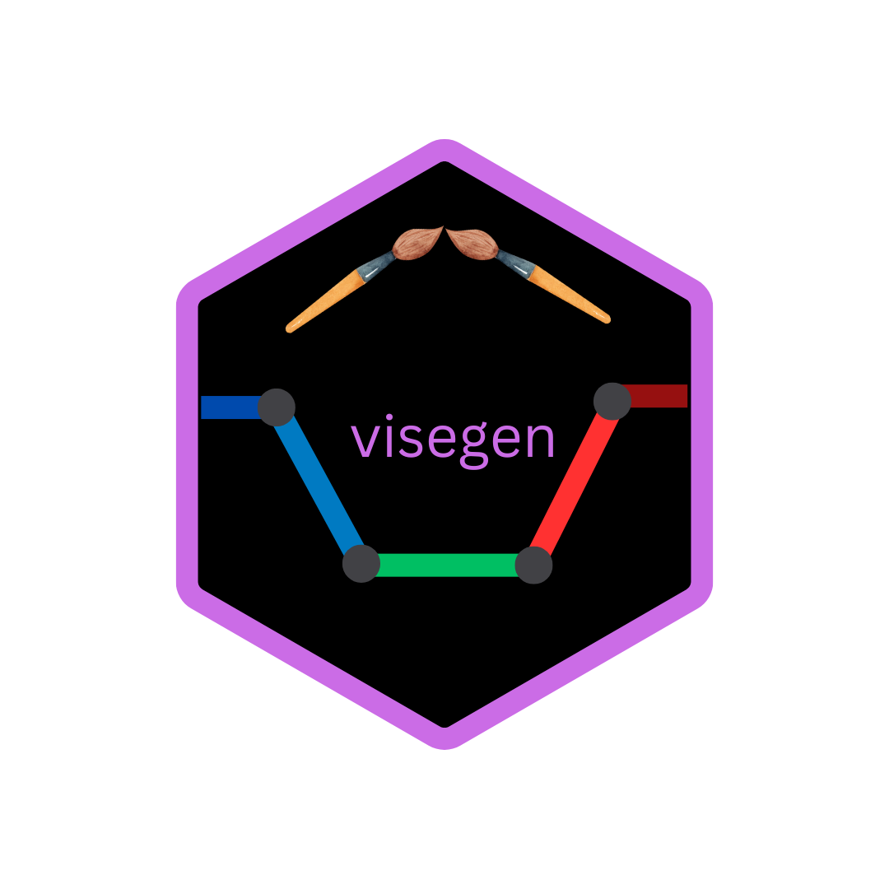
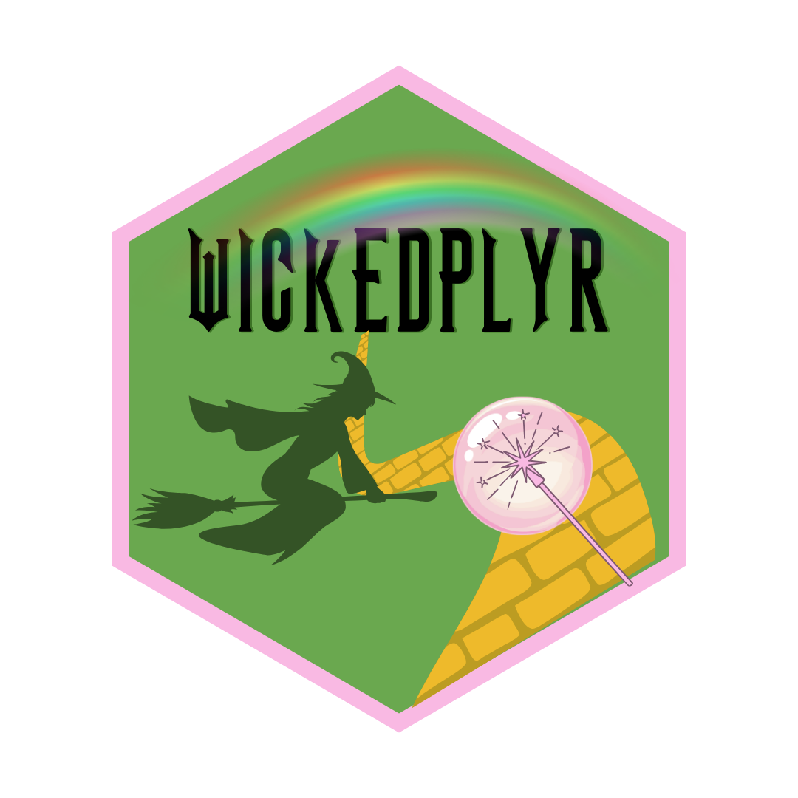
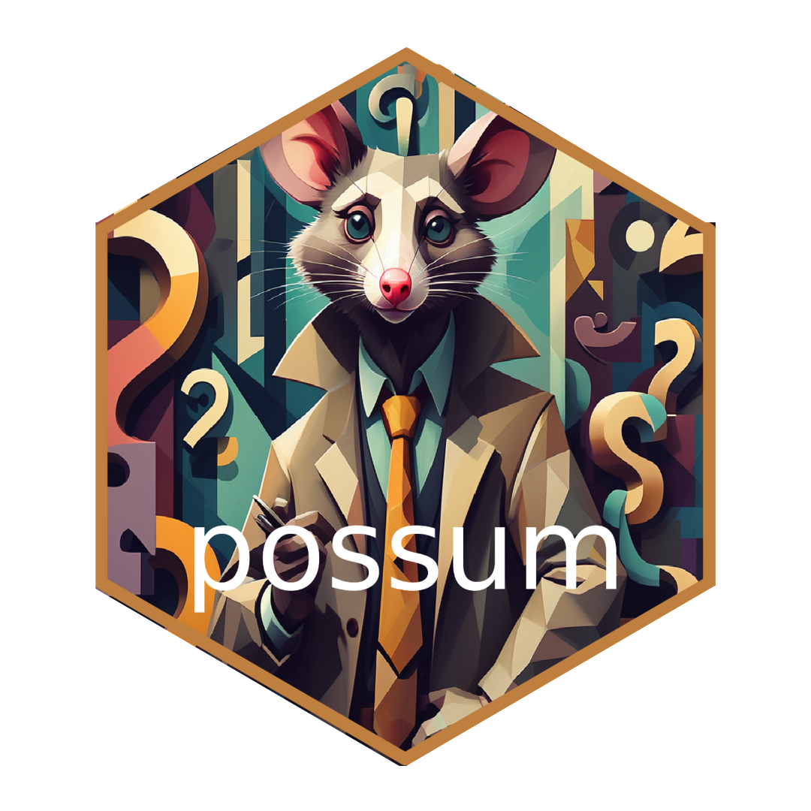
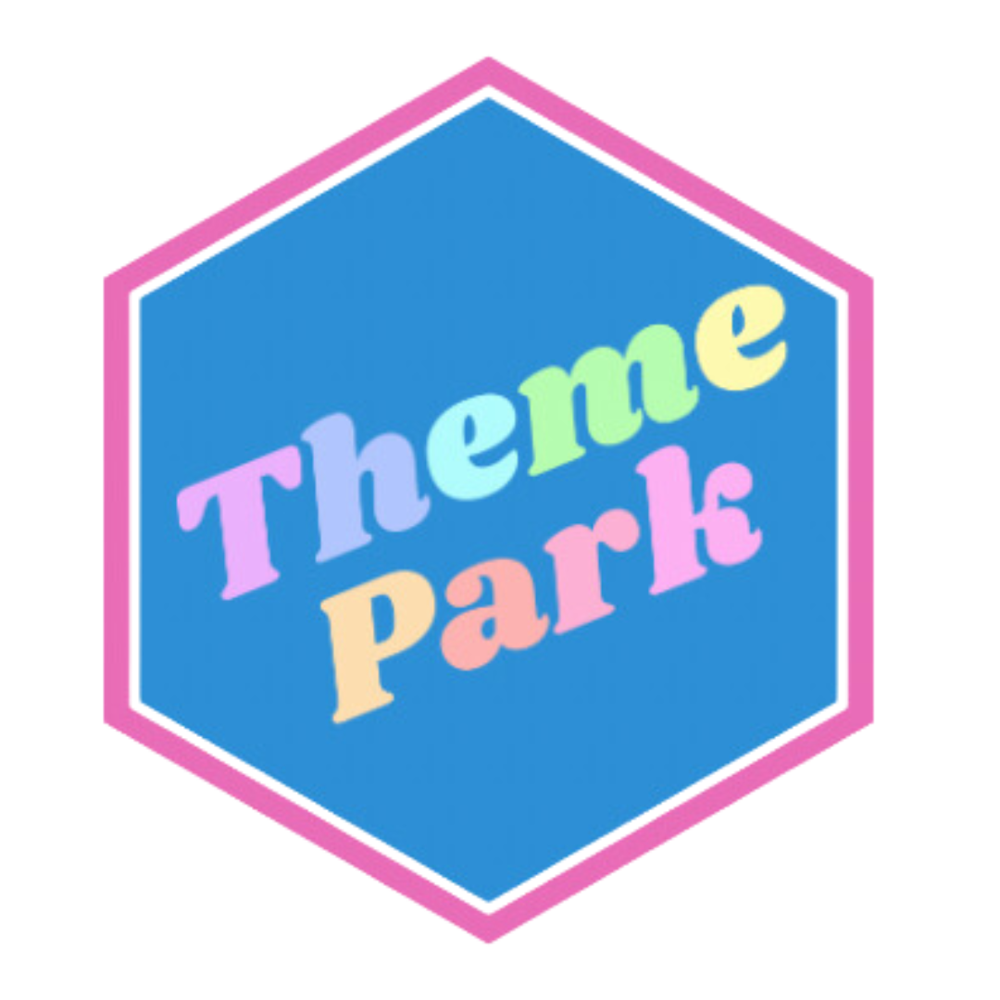

What, like it's hardware? No, it's software! Click on the hexes to learn more.

### I'm the Author

::: {.panel-tabset}

#### visegen

:::: {.columns}

::: {.column width="50%"}

The `visegen` R package (in progress) is based on work by Nick Micheletti and visualizes cost-effectiveness curves constructed with second-generation p-values.

:::

::: {.column width="50%"}

  
 
:::

::::

 
#### wickedplyr

:::: {.columns}

::: {.column width="50%"}

The `wickedplyr` R package (in progress, jointly written with Hannah Klinger) was inspired by [genzplyr](https://github.com/hadley/genzplyr) and [boomerplyr](https://bradlindblad.github.io/boomerplyr/) and overwrites `dplyr` functions with Wicked-themed names.

:::

::: {.column width="50%"}

  
 
:::

::::
 
:::

### I'm a Contributor

::: {.panel-tabset}

#### possum

:::: {.columns}

::: {.column width="50%"}

Along with other fun tools for not-so-perfect count outcomes, the maximum likelihood estimator for Poisson regression (with a misclassified covariate) that I derived during my master's thesis lives in the `possum` R package!

:::

::: {.column width="50%"}

  
 
:::

::::

#### ThemePark

:::: {.columns}

::: {.column width="50%"}

Along with other cool ways to jazz up your ggplot, my *The Tortured Poets Department* ggplot theme lives in the ThemePark R package.

:::

::: {.column width="50%"}

  
 
:::

::::

:::

### I'm a Big Fan

::: {layout-ncol=4}

🎨 [ggplot2](https://ggplot2.tidyverse.org/) 

🗺️ [tidycensus](https://walker-data.com/tidycensus/)

🎵 [gm](https://github.com/flujoo/gm) 

🤣 [memer](https://github.com/sctyner/memer)

🔔 [beepr](https://cran.r-project.org/web/packages/beepr/index.html)

🥰 [praise](https://cran.r-project.org/web/packages/praise/index.html)

📜 [gt](https://gt.rstudio.com/)

🦒 [ggiraph](https://davidgohel.github.io/ggiraph/)

:::

